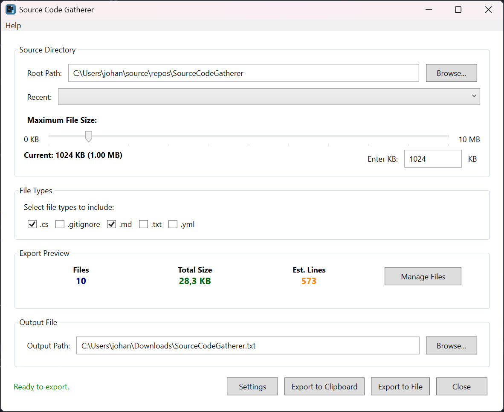

# Source Code Gatherer

Easily collect and share your code files in one organized document. Perfect for sharing your project with AI assistants, conducting code reviews, or creating documentation.


## ✨ What It Does

Source Code Gatherer takes all your project files and combines them into a single, well-organized document. Whether you're working with ChatGPT, Claude, or other AI tools, this makes it easy to share your entire codebase for analysis, debugging, or enhancement suggestions.



## 🎯 Perfect For

- **AI Assistance**: Share your complete project with AI tools for better help and suggestions
- **Code Reviews**: Send your entire codebase to colleagues in one clean document
- **Documentation**: Create comprehensive project snapshots for reference
- **Backup & Archive**: Keep organized copies of your project's source code
- **Learning**: Study how projects are structured by examining complete codebases

## 🚀 Key Features

- **One-Click Collection**: Simply select your project folder and let the app do the work
- **Smart File Detection**: Automatically finds all your code files (40+ file types supported)
- **Choose What to Include**: Pick exactly which file types you want in your export
- **Two Export Options**:
  - Save to a file on your computer
  - Copy directly to clipboard for instant sharing
- **Works with Large Projects**: Handles big codebases efficiently with progress tracking
- **Remembers Your Preferences**: Saves your settings for each project you work on
- **Clean, Organized Output**: Each file is clearly labeled with its location in your project

## 💻 System Requirements

- Windows 10 or newer
- [.NET 8.0 Runtime](https://dotnet.microsoft.com/download/dotnet/8.0) (free download from Microsoft)

## 📥 Getting Started

**Easy Installation:**
1. Download the latest version from our [Releases page](https://github.com/dekmaskin/SourceCodeGatherer/releases)
2. Extract the zip file to a folder of your choice
3. Run `SourceCodeGatherer.exe`

That's it! No complex setup required.

## 🎮 How to Use

**It's as simple as 1-2-3:**

1. **Pick Your Project Folder**
   - Click "Browse" and select your project directory
   - Or simply drag and drop your folder into the app
   - The app instantly finds all your code files

2. **Choose What to Include**
   - See all the file types in your project
   - Check the boxes for the files you want to include
   - Common types like .js, .py, .cs, .html are automatically detected

3. **Get Your Code**
   - **Save to File**: Creates a document you can save anywhere
   - **Copy to Clipboard**: Instantly ready to paste into ChatGPT, emails, or anywhere else

**Pro Tip**: The app remembers your preferences for each project, so next time you open the same folder, your settings are already there!

## 🧠 Smart Memory

The app learns from how you work:

- **Remembers Your Projects**: Each project folder keeps its own settings
- **Saves Your Preferences**: File types, window size, and export locations are remembered
- **Quick Access**: Recent projects appear in a dropdown for easy switching
- **No Setup Hassle**: Switch between projects without reconfiguring everything

## 🛠️ Need Help?

If something isn't working right:

- Check that you have the .NET 8.0 Runtime installed
- Make sure you have permission to read the folders you're trying to scan
- The app keeps helpful logs in your user folder if you need to troubleshoot
- Feel free to open an issue on our GitHub page

## 📄 What You Get

Your exported code is organized in a clean, readable format:

```
=== FILE: src/components/Header.js ===

[Your actual file contents appear here]

=== END OF FILE ===
```

Each file is clearly labeled with its location in your project, making it easy to understand the structure.

## 🌐 Supported Languages

Works with 40+ programming languages and file types:

**Popular Languages**: JavaScript, Python, C#, Java, C++, Go, Rust, Swift, PHP, Ruby

**Web Development**: HTML, CSS, React (JSX), TypeScript, Vue, Svelte

**Configuration Files**: JSON, XML, YAML, environment files, config files

**Scripts & More**: Shell scripts, batch files, PowerShell, and many others

Don't see your language? The app automatically detects text-based files, so it likely works with your code too!

## 💡 Common Use Cases

**Working with AI Tools:**
- Share your entire project with ChatGPT, Claude, or other AI assistants
- Get better suggestions when the AI can see your complete codebase
- Debug issues by providing full context

## 📞 Questions or Issues?

- Check out our [Issues page](https://github.com/dekmaskin/SourceCodeGatherer/issues) for common questions
- Report bugs or request features
- Make sure you have the .NET 8.0 Runtime installed

## 📄 License

Free to use under the MIT License - see the [LICENSE](LICENSE.txt) file for details.

---

**Built for developers who want to work smarter with AI tools** ✨
